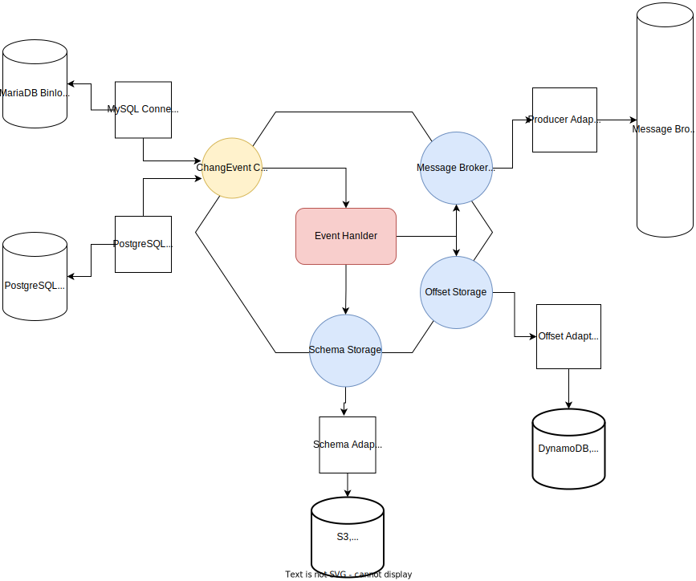

# Introduction
The custom service is designed to capture data changes from MariaDB tables utilizing the Debezium MySQL connector adapter and an embedded engine. It efficiently monitors and extracts the changes occurring in the database. These changes are then transformed into messages and seamlessly sent to AWS Kinesis, a powerful and scalable event streaming platform.

To ensure reliable and accurate processing, the service leverages DynamoDB for tracking offsets. This allows for efficient management and synchronization of data across multiple instances of the service. Additionally, it utilizes S3 as a storage option for maintaining backups or storing additional relevant information.
## Basic Architecture

These events are then seamlessly streamed to Kinesis, which serves as a reliable event streaming platform, and stored in DynamoDB for efficient offset management.

By leveraging this customized approach, the service reduces its dependency on Kafka, providing flexibility and adaptability to meet specific use cases. Moreover, clients have the freedom to choose their preferred infrastructure components, such as Nats broker, Redis, or even S3, to construct a highly customized and robust durability architecture that aligns with their unique requirements.

## Get Started
### Prerequisites
- Java 8 or upper development environment
- An Amazon AWS account
- The AWS CLI client

## TODO:
